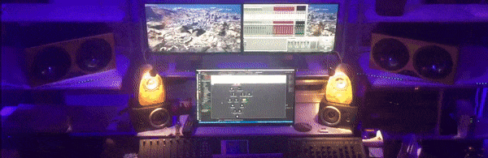
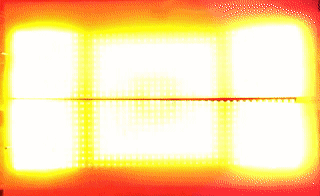
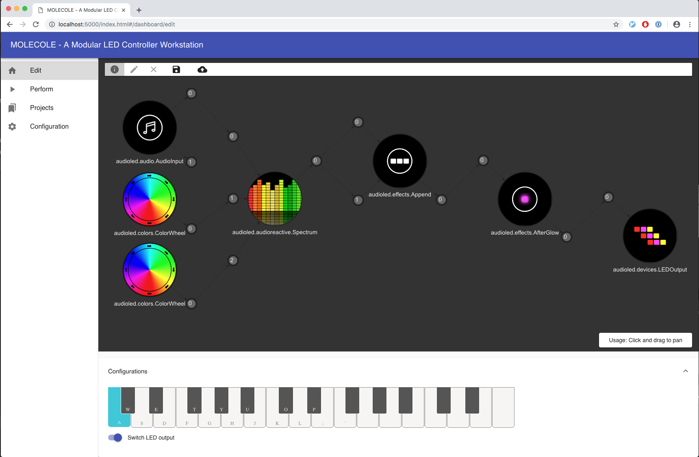

# MOLECOLE - A Modular LED Controller Workstation

[](https://travis-ci.org/segfault16/audio-reactive-led-strip)

MOLECOLE is a real-time LED controller for the Raspberry Pi. 

It comes with a bunch of modules to generate and manipulate pixels, so you can configure your own music visualizer or ambient lighting for LED strips.



It even supports LED panels!



For runtime configuration there is a REST webserver with a web UI.



Configurations can be stored in git and do adapt to output strip or panel.


The works in this project is based on [https://github.com/scottlawsonbc/audio-reactive-led-strip](https://github.com/scottlawsonbc/audio-reactive-led-strip).


# Getting started (local machine)

## Python Dependencies
MOLECOLE requires at least Python 3.7 and uses [pipenv](https://github.com/pypa/pipenv) to manage dependencies.

- Get pipenv
- Run `pipenv install`

## OpenPixelControl Visualization Server

For running MOLECOLE without a RaspberryPi we need to somehow visualize the RGB data.
For this you can use [openpixelcontrol](https://github.com/zestyping/openpixelcontrol).

- Clone the project parallel to this repository
- Follow the instructions to compile the project
- Use the compiled binary `gl_server` to start an OpenGL visualization server on localhost port 7890 to visualize the RGB data

```bash
# A LED Strip with 300 pixels
../openpixelcontrol/bin/gl_server -l layouts/demo_layout.json
# or a LED Panel with 44x22 pixels
../openpixelcontrol/bin/gl_server -l layouts/wall_44x22.json
```

## Running MOLECOLE

```bash
# Run with clean config and without storing
pipenv python server.py --no_conf --no_store
# Run with LED Strip configuration
pipenv python server.py -N 300
# Run with LED Panel configuration
pipenv python server.py -N 968 -R 22
# For more information:
pipenv python server.py -h
```

You should now see some RGB data in OpenPixelControl and should be able to access the MOLECOLE UI on https://localhost:5000.

Start playing around or upload some sample configurations from [configurations](./configurations).


# Getting started (Raspberry Pi)

See [Running on RaspberryPi](./docs/pi_setup.md).


